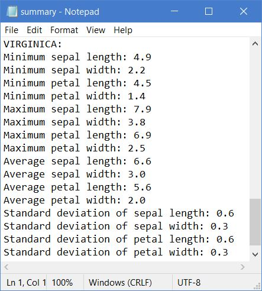

# Programming and Scripting Project

## Contents
1. Problem Statement
2. Summary of Fisher's Iris Data Set
3. Summary Statistics
4. Univariate Analysis
5. Bi-Variate Analysis
6. Scatterplot Matrix
7. Executing the Python Script
8. References

## 1. Problem Statement
This project concerns the well-known Fisher's Iris data set. You must research the data set and write documentation and code in Python to investigate it. An online search for information on the data set will convince you that many people have investigated it previously. You are expected to be able to break this project into several smaller tasks that are easier to solve, and to plug these together after they have been completed.

## 2. Summary of Fisher's Iris Data Set


Sir Ronald Fisher (1890-1962) was a British statistician and geneticist, and has been described as "the single most important figure in 20th century statistics". In 1936 he introducted the multivariate data set referred to as the Iris flower data set, or Fisher's Iris data set, in his paper *The use of multiple measurements in taxonomic problems* as an example of linear discriminant analysis. It is sometimes referred to as Anderson's Iris data set, as it was Edgar Anderson who collected the data to quantify the morphologic variation of iris flowers of three related species. There are 150 rows of data in the data set, with each row representing an iris flower. [Ref: Iris flower data set](https://en.wikipedia.org/wiki/Iris_flower_data_set)    


The images above show the three species included in the data set: setosa, virginica and versicolor. The data set comprises 50 records of each species with their botanical dimensions, sepal and petal, on each row. The sepal is described as the part of the flower with angiosperms (flowering plants). Sepals typically function as protection for the flower in bud, and often as support for the petals when in bloom. [Ref: Sepal](https://en.wikipedia.org/wiki/Sepal) Petals are described as modified leaves that surround the reproductive parts of flowers. They are often brightly coloured or unusually shaped to attract pollinators. [Ref: Petal](https://en.wikipedia.org/wiki/Petal)


Although the initial purpose of the data set was to identify the botanical variations of iris flowers, it has since become a staple test case in computer science. It is a well-known data set which programmers repeatedly use as input to examine how various technologies sort and handle data sets. [Ref: Alternative uses](https://www.techopedia.com/definition/32880/iris-flower-data-set) The data set is often used in data mining, classification and clustering examples. [Ref: Visualising and understanding Iris dataset](https://mc.ai/visualization-and-understanding-iris-dataset/). The diagram above illustrates a neural network used in machine learning to categorise iris flowers by species. [Ref: Machine learning](https://www.tensorflow.org/tutorials/customization/custom_training_walkthrough) The table below comprises the 150 samples, which include the sepal length, sepal width, petal length, petal width, and species of each record.

|Sepal Length | Sepal Width | Petal Length | Petal Width | Species |
| --- | --- | --- | --- | --- |
5.1 | 3.5 | 1.4 | 0.2 | setosa
4.9 | 3.0 | 1.4 | 0.2 | setosa
4.7 | 3.2 | 1.3 | 0.2 | setosa
4.6 | 3.1 | 1.5 | 0.2 | setosa
5.0 | 3.6 | 1.4 | 0.2 | setosa
5.4 | 3.9 | 1.7 | 0.4 | setosa
4.6 | 3.4 | 1.4 | 0.3 | setosa
5.0 | 3.4 | 1.5 | 0.2 | setosa
4.4 | 2.9 | 1.4 | 0.2 | setosa
4.9 | 3.1 | 1.5 | 0.1 | setosa
5.4 | 3.7 | 1.5 | 0.2 | setosa
4.8 | 3.4 | 1.6 | 0.2 | setosa
4.8 | 3.0 | 1.4 | 0.1 | setosa
4.3 | 3.0 | 1.1 | 0.1 | setosa
5.8 | 4.0 | 1.2 | 0.2 | setosa
5.7 | 4.4 | 1.5 | 0.4 | setosa
5.4 | 3.9 | 1.3 | 0.4 | setosa
5.1 | 3.5 | 1.4 | 0.3 | setosa
5.7 | 3.8 | 1.7 | 0.3 | setosa
5.1 | 3.8 | 1.5 | 0.3 | setosa
5.4 | 3.4 | 1.7 | 0.2 | setosa
5.1 | 3.7 | 1.5 | 0.4 | setosa
4.6 | 3.6 | 1.0 | 0.2 | setosa
5.1 | 3.3 | 1.7 | 0.5 | setosa
4.8 | 3.4 | 1.9 | 0.2 | setosa
5.0 | 3.0 | 1.6 | 0.2 | setosa
5.0 | 3.4 | 1.6 | 0.4 | setosa
5.2 | 3.5 | 1.5 | 0.2 | setosa
5.2 | 3.4 | 1.4 | 0.2 | setosa
4.7 | 3.2 | 1.6 | 0.2 | setosa
4.8 | 3.1 | 1.6 | 0.2 | setosa
5.4 | 3.4 | 1.5 | 0.4 | setosa
5.2 | 4.1 | 1.5 | 0.1 | setosa
5.5 | 4.2 | 1.4 | 0.2 | setosa
4.9 | 3.1 | 1.5 | 0.1 | setosa
5.0 | 3.2 | 1.2 | 0.2 | setosa
5.5 | 3.5 | 1.3 | 0.2 | setosa
4.9 | 3.1 | 1.5 | 0.1 | setosa
4.4 | 3.0 | 1.3 | 0.2 | setosa
5.1 | 3.4 | 1.5 | 0.2 | setosa
5.0 | 3.5 | 1.3 | 0.3 | setosa
4.5 | 2.3 | 1.3 | 0.3 | setosa
4.4 | 3.2 | 1.3 | 0.2 | setosa
5.0 | 3.5 | 1.6 | 0.6 | setosa
5.1 | 3.8 | 1.9 | 0.4 | setosa
4.8 | 3.0 | 1.4 | 0.3 | setosa
5.1 | 3.8 | 1.6 | 0.2 | setosa
4.6 | 3.2 | 1.4 | 0.2 | setosa
5.3 | 3.7 | 1.5 | 0.2 | setosa
5.0 | 3.3 | 1.4 | 0.2 | setosa
7.0 | 3.2 | 4.7 | 1.4 | versicolor
6.4 | 3.2 | 4.5 | 1.5 | versicolor
6.9 | 3.1 | 4.9 | 1.5 | versicolor
5.5 | 2.3 | 4.0 | 1.3 | versicolor
6.5 | 2.8 | 4.6 | 1.5 | versicolor
5.7 | 2.8 | 4.5 | 1.3 | versicolor
6.3 | 3.3 | 4.7 | 1.6 | versicolor
4.9 | 2.4 | 3.3 | 1.0 | versicolor
6.6 | 2.9 | 4.6 | 1.3 | versicolor
5.2 | 2.7 | 3.9 | 1.4 | versicolor
5.0 | 2.0 | 3.5 | 1.0 | versicolor
5.9 | 3.0 | 4.2 | 1.5 | versicolor
6.0 | 2.2 | 4.0 | 1.0 | versicolor
6.1 | 2.9 | 4.7 | 1.4 | versicolor
5.6 | 2.9 | 3.6 | 1.3 | versicolor
6.7 | 3.1 | 4.4 | 1.4 | versicolor
5.6 | 3.0 | 4.5 | 1.5 | versicolor
5.8 | 2.7 | 4.1 | 1.0 | versicolor
6.2 | 2.2 | 4.5 | 1.5 | versicolor
5.6 | 2.5 | 3.9 | 1.1 | versicolor
5.9 | 3.2 | 4.8 | 1.8 | versicolor
6.1 | 2.8 | 4.0 | 1.3 | versicolor
6.3 | 2.5 | 4.9 | 1.5 | versicolor
6.1 | 2.8 | 4.7 | 1.2 | versicolor
6.4 | 2.9 | 4.3 | 1.3 | versicolor
6.6 | 3.0 | 4.4 | 1.4 | versicolor
6.8 | 2.8 | 4.8 | 1.4 | versicolor
6.7 | 3.0 | 5.0 | 1.7 | versicolor
6.0 | 2.9 | 4.5 | 1.5 | versicolor
5.7 | 2.6 | 3.5 | 1.0 | versicolor
5.5 | 2.4 | 3.8 | 1.1 | versicolor
5.5 | 2.4 | 3.7 | 1.0 | versicolor
5.8 | 2.7 | 3.9 | 1.2 | versicolor
6.0 | 2.7 | 5.1 | 1.6 | versicolor
5.4 | 3.0 | 4.5 | 1.5 | versicolor
6.0 | 3.4 | 4.5 | 1.6 | versicolor
6.7 | 3.1 | 4.7 | 1.5 | versicolor
6.3 | 2.3 | 4.4 | 1.3 | versicolor
5.6 | 3.0 | 4.1 | 1.3 | versicolor
5.5 | 2.5 | 4.0 | 1.3 | versicolor
5.5 | 2.6 | 4.4 | 1.2 | versicolor
6.1 | 3.0 | 4.6 | 1.4 | versicolor
5.8 | 2.6 | 4.0 | 1.2 | versicolor
5.0 | 2.3 | 3.3 | 1.0 | versicolor
5.6 | 2.7 | 4.2 | 1.3 | versicolor
5.7 | 3.0 | 4.2 | 1.2 | versicolor
5.7 | 2.9 | 4.2 | 1.3 | versicolor
6.2 | 2.9 | 4.3 | 1.3 | versicolor
5.1 | 2.5 | 3.0 | 1.1 | versicolor
5.7 | 2.8 | 4.1 | 1.3 | versicolor
6.3 | 3.3 | 6.0 | 2.5 | virginica
5.8 | 2.7 | 5.1 | 1.9 | virginica
7.1 | 3.0 | 5.9 | 2.1 | virginica
6.3 | 2.9 | 5.6 | 1.8 | virginica
6.5 | 3.0 | 5.8 | 2.2 | virginica
7.6 | 3.0 | 6.6 | 2.1 | virginica
4.9 | 2.5 | 4.5 | 1.7 | virginica
7.3 | 2.9 | 6.3 | 1.8 | virginica
6.7 | 2.5 | 5.8 | 1.8 | virginica
7.2 | 3.6 | 6.1 | 2.5 | virginica
6.5 | 3.2 | 5.1 | 2.0 | virginica
6.4 | 2.7 | 5.3 | 1.9 | virginica
6.8 | 3.0 | 5.5 | 2.1 | virginica
5.7 | 2.5 | 5.0 | 2.0 | virginica
5.8 | 2.8 | 5.1 | 2.4 | virginica
6.4 | 3.2 | 5.3 | 2.3 | virginica
6.5 | 3.0 | 5.5 | 1.8 | virginica
7.7 | 3.8 | 6.7 | 2.2 | virginica
7.7 | 2.6 | 6.9 | 2.3 | virginica
6.0 | 2.2 | 5.0 | 1.5 | virginica
6.9 | 3.2 | 5.7 | 2.3 | virginica
5.6 | 2.8 | 4.9 | 2.0 | virginica
7.7 | 2.8 | 6.7 | 2.0 | virginica
6.3 | 2.7 | 4.9 | 1.8 | virginica
6.7 | 3.3 | 5.7 | 2.1 | virginica
7.2 | 3.2 | 6.0 | 1.8 | virginica
6.2 | 2.8 | 4.8 | 1.8 | virginica
6.1 | 3.0 | 4.9 | 1.8 | virginica
6.4 | 2.8 | 5.6 | 2.1 | virginica
7.2 | 3.0 | 5.8 | 1.6 | virginica
7.4 | 2.8 | 6.1 | 1.9 | virginica
7.9 | 3.8 | 6.4 | 2.0 | virginica
6.4 | 2.8 | 5.6 | 2.2 | virginica
6.3 | 2.8 | 5.1 | 1.5 | virginica
6.1 | 2.6 | 5.6 | 1.4 | virginica
7.7 | 3.0 | 6.1 | 2.3 | virginica
6.3 | 3.4 | 5.6 | 2.4 | virginica
6.4 | 3.1 | 5.5 | 1.8 | virginica
6.0 | 3.0 | 4.8 | 1.8 | virginica
6.9 | 3.1 | 5.4 | 2.1 | virginica
6.7 | 3.1 | 5.6 | 2.4 | virginica
6.9 | 3.1 | 5.1 | 2.3 | virginica
5.8 | 2.7 | 5.1 | 1.9 | virginica
6.8 | 3.2 | 5.9 | 2.3 | virginica
6.7 | 3.3 | 5.7 | 2.5 | virginica
6.7 | 3.0 | 5.2 | 2.3 | virginica
6.3 | 2.5 | 5.0 | 1.9 | virginica
6.5 | 3.0 | 5.2 | 2.0 | virginica
6.2 | 3.4 | 5.4 | 2.3 | virginica
5.9 | 3.0 | 5.1 | 1.8 | virginica

## 3. Summary Statistics

The data set is read using the ```read_csv()``` function from the Pandas library and stored in a variable as a DataFrame. [Ref: pandas.read_csv](https://pandas.pydata.org/pandas-docs/version/0.21.1/generated/pandas.read_csv.html) A DataFrame is a two-dimensional labelled data structure with columns of potentially different types, aligned in a tabular fashion in rows and columns. [Ref: DataFrame](https://pandas.pydata.org/pandas-docs/stable/getting_started/dsintro.html) The next step in generating the summary text file is to create empty lists for the overall data set and individual species. These lists are then populated with strings to be written to the output file.

```Python
df = pd.read_csv('iris_data.csv')

lst_tot = []
lst_set = []
lst_ver = []
lst_vir = []
```

The minimum, maximum, average, and standard deviation of each variable is calculated for the overall data set as well as each species individually. The ```min()```, ```max()```, ```mean()```, and ```std()``` functions generate summary statistics for each column.  The ```str()``` method converts each calculation to a string, which is then concatenated with the rest of the sentence to form a single string. The ```append()``` method adds a single item to the existing list. Indexing with the ```[]``` operator finds the given element in the DataFrame and returns its position, so ```['sepal_length']``` returns the sepal length column, ```['sepal_width']``` returns the sepal width column, ```['petal_length']``` returns the petal length column, and ```['sepal_length']``` returns the sepal length column. Slicing with the ```[]``` operator returns a subset of the data set. As the setosa species is the first 50 rows, the versicolor species is the next 50 rows and the virginica species is the last 50 rows, ```[:50]```, ```[50:100]``` and ```[100:]``` returns those rows respectively. This allows the calculations to be applied to those rows only. [Ref: Indexing and selecting data](https://pandas.pydata.org/pandas-docs/stable/user_guide/indexing.html)

```Python
lst_tot.append('Minimum sepal length: ' + str(df['sepal_length'].min()))
lst_tot.append('Minimum sepal width: ' + str(df['sepal_width'].min()))
lst_tot.append('Minimum petal length: ' + str(df['petal_length'].min()))
lst_tot.append('Minimum petal width: ' + str(df['petal_width'].min()))
lst_tot.append('Maximum sepal length: ' + str(df['sepal_length'].max()))
lst_tot.append('Maximum sepal width: ' + str(df['sepal_width'].max()))
lst_tot.append('Maximum petal length: ' + str(df['petal_length'].max()))
lst_tot.append('Maximum petal width: ' + str(df['petal_width'].max()))
lst_tot.append('Average sepal length: ' + str(round(df['sepal_length'].mean(), 1)))
lst_tot.append('Average sepal width: ' + str(round(df['sepal_width'].mean(), 1)))
lst_tot.append('Average petal length: ' + str(round(df['petal_length'].mean(), 1)))
lst_tot.append('Average petal width: ' + str(round(df['petal_width'].mean(), 1)))
lst_tot.append('Standard deviation of sepal length: ' + str(round(df['sepal_length'].std(), 1)))
lst_tot.append('Standard deviation of sepal width: ' + str(round(df['sepal_width'].std(), 1)))
lst_tot.append('Standard deviation of petal length: ' + str(round(df['petal_length'].std(), 1)))
lst_tot.append('Standard deviation of petal width: ' + str(round(df['petal_width'].std(), 1)))

lst_set.append('Minimum sepal length: ' + str(df['sepal_length'][:50].min()))
lst_set.append('Minimum sepal width: ' + str(df['sepal_width'][:50].min()))
lst_set.append('Minimum petal length: ' + str(df['petal_length'][:50].min()))
lst_set.append('Minimum petal width: ' + str(df['petal_width'][:50].min()))
lst_set.append('Maximum sepal length: ' + str(df['sepal_length'][:50].max()))
lst_set.append('Maximum sepal width: ' + str(df['sepal_width'][:50].max()))
lst_set.append('Maximum petal length: ' + str(df['petal_length'][:50].max()))
lst_set.append('Maximum petal width: ' + str(df['petal_width'][:50].max()))
lst_set.append('Average sepal length: ' + str(round(df['sepal_length'][:50].mean(), 1)))
lst_set.append('Average sepal width: ' + str(round(df['sepal_width'][:50].mean(), 1)))
lst_set.append('Average petal length: ' + str(round(df['petal_length'][:50].mean(), 1)))
lst_set.append('Average petal width: ' + str(round(df['petal_width'][:50].mean(), 1)))
lst_set.append('Standard deviation of sepal length: ' + str(round(df['sepal_length'][:50].std(), 1)))
lst_set.append('Standard deviation of sepal width: ' + str(round(df['sepal_width'][:50].std(), 1)))
lst_set.append('Standard deviation of petal length: ' + str(round(df['petal_length'][:50].std(), 1)))
lst_set.append('Standard deviation of petal width: ' + str(round(df['petal_width'][:50].std(), 1)))

lst_ver.append('Minimum sepal length: ' + str(df['sepal_length'][50:100].min()))
lst_ver.append('Minimum sepal width: ' + str(df['sepal_width'][50:100].min()))
lst_ver.append('Minimum petal length: ' + str(df['petal_length'][50:100].min()))
lst_ver.append('Minimum petal width: ' + str(df['petal_width'][50:100].min()))
lst_ver.append('Maximum sepal length: ' + str(df['sepal_length'][50:100].max()))
lst_ver.append('Maximum sepal width: ' + str(df['sepal_width'][50:100].max()))
lst_ver.append('Maximum petal length: ' + str(df['petal_length'][50:100].max()))
lst_ver.append('Maximum petal width: ' + str(df['petal_width'][50:100].max()))
lst_ver.append('Average sepal length: ' + str(round(df['sepal_length'][50:100].mean(), 1)))
lst_ver.append('Average sepal width: ' + str(round(df['sepal_width'][50:100].mean(), 1)))
lst_ver.append('Average petal length: ' + str(round(df['petal_length'][50:100].mean(), 1)))
lst_ver.append('Average petal width: ' + str(round(df['petal_width'][50:100].mean(), 1)))
lst_ver.append('Standard deviation of sepal length: ' + str(round(df['sepal_length'][50:100].std(), 1)))
lst_ver.append('Standard deviation of sepal width: ' + str(round(df['sepal_width'][50:100].std(), 1)))
lst_ver.append('Standard deviation of petal length: ' + str(round(df['petal_length'][50:100].std(), 1)))
lst_ver.append('Standard deviation of petal width: ' + str(round(df['petal_width'][50:100].std(), 1)))

lst_vir.append('Minimum sepal length: ' + str(df['sepal_length'][100:].min()))
lst_vir.append('Minimum sepal width: ' + str(df['sepal_width'][100:].min()))
lst_vir.append('Minimum petal length: ' + str(df['petal_length'][100:].min()))
lst_vir.append('Minimum petal width: ' + str(df['petal_width'][100:].min()))
lst_vir.append('Maximum sepal length: ' + str(df['sepal_length'][100:].max()))
lst_vir.append('Maximum sepal width: ' + str(df['sepal_width'][100:].max()))
lst_vir.append('Maximum petal length: ' + str(df['petal_length'][100:].max()))
lst_vir.append('Maximum petal width: ' + str(df['petal_width'][100:].max()))
lst_vir.append('Average sepal length: ' + str(round(df['sepal_length'][100:].mean(), 1)))
lst_vir.append('Average sepal width: ' + str(round(df['sepal_width'][100:].mean(), 1)))
lst_vir.append('Average petal length: ' + str(round(df['petal_length'][100:].mean(), 1)))
lst_vir.append('Average petal width: ' + str(round(df['petal_width'][100:].mean(), 1)))
lst_vir.append('Standard deviation of sepal length: ' + str(round(df['sepal_length'][100:].std(), 1)))
lst_vir.append('Standard deviation of sepal width: ' + str(round(df['sepal_width'][100:].std(), 1)))
lst_vir.append('Standard deviation of petal length: ' + str(round(df['petal_length'][100:].std(), 1)))
lst_vir.append('Standard deviation of petal width: ' + str(round(df['petal_width'][100:].std(), 1)))
```

A writable text file named 'summary.txt' is created using the ```open()``` method, and writes each element of each list in turn to the file using a For loop and the ```write()``` method. 

```Python
with open('summary.txt', 'w') as f:
    
    f.write('ALL SPECIES:\n')

    for val in lst_tot:
        f.write(val + '\n')

    f.write('\nSETOSA:\n')    

    for val in lst_set:
        f.write(val + '\n')

    f.write('\nVERSICOLOR:\n')

    for val in lst_ver:
        f.write(val + '\n')

    f.write('\nVIRGINICA:\n')

    for val in lst_vir:
        f.write(val + '\n')
```

The images below show the contents of the generated text file.




## 4. Univariate Analysis
Histograms provide a visualisation of numerical, univariate data by indicating the number of data points that lie within a range of values. These range of values are referred to as classes or bins. The frequency of data that falls within each class is illustrated by the use of a bar. The higher that bar is, the greater the frequency of data values within that bin. It can also be described as a bar chart for continuous data values. [Ref: Histogram](https://en.wikipedia.org/wiki/Histogram) To generate histograms for each column in the data set, the ```genfromtxt()``` method from the Numpy library is used to read the data. [Ref: numpy.genfromtxt](https://docs.scipy.org/doc/numpy/reference/generated/numpy.genfromtxt.html) The ```delimiter``` parameter is set to a comma and the ```skip_header``` parameter is set to '1' to exclude the column headings. 

A histogram is created for the following variables:
1. Sepal length
2. Sepal width
3. Petal length
4. Petal width 

```Python
data_set = np.genfromtxt('iris_data.csv', delimiter=',', skip_header=1)
```

Pyplot is a state-based interface to Matplotlib library and can be used to create a variety of visualisations. [Ref: matplotlib.pyplot](https://matplotlib.org/3.1.1/api/_as_gen/matplotlib.pyplot.html) In the code below, indexing is first applied to select each column in the array, which are then assigned to a variable: ```col_1 = data_set[:,0]```, ```col_2 = data_set[:,1]```, ```col_3 = data_set[:,2]```, and ```col_4 = data_set[:,3]```. The ```pyplot.hist()``` function plots a histogram and sets the number of bins and colour of the bars. [Ref: plyplot.hist](https://matplotlib.org/3.1.1/api/_as_gen/matplotlib.pyplot.hist.html) The ```pl.title()``` function applies a title to the output and sets the font size. The ```pl.grid()``` function applies grid lines to the plot area. In this instance, the ```which``` parameter is set to 'major' and the ```axis``` parameter is set to 'y' to only show major grid lines on the y-axis. The ```pl.xlabel()``` and ```pl.ylabel()``` functions applies labels to the x-axis and y-axis respectively, while the ```pl.show()``` function outputs the histograms in PNG format.

```Python
col_1 = data_set[:,0]
pl.hist(col_1, bins=20, color='#3F5D7D')
pl.title('Sepal Length', fontsize=16)
pl.grid(which='major', axis='y')
pl.xlabel('Length (cm)')
pl.ylabel('Frequency')
pl.show()

col_2 = data_set[:,1]
pl.hist(col_2, bins=20, color='#3F5D7D')
pl.title('Sepal Width', fontsize=16)
pl.grid(which='major', axis='y')
pl.xlabel('Width (cm)')
pl.ylabel('Frequency')
pl.show()

col_3 = data_set[:,2]
pl.hist(col_3, bins=20, color='#3F5D7D')
pl.title('Petal Length', fontsize=16)
pl.grid(which='major', axis='y')
pl.xlabel('Length (cm)')
pl.ylabel('Frequency')
pl.show()

col_4 = data_set[:,3]
pl.hist(col_4, bins=20, color='#3F5D7D')
pl.title('Petal Width', fontsize=16)
pl.grid(which='major', axis='y')
pl.xlabel('Width (cm)')
pl.ylabel('Frequency')
pl.show()
```

The histograms below allow for the easy identification of the distribution and frequency of the variables within the data set.

**Sepal Length**


As established in the generated summary file, the average sepal length is 5.8cm, the minimum value is 4.3cm, the maximum is 7.9cm, and the standard deviation is 0.8cm. The histogram above illustrates the frequency of these values. The minimum value of sepal length starts on the x-axis at 4.3cm and the maximum value finishes on the x-axis at 7.9cm. The y-axis also shows the frequency in which these values occur. The histogram bars appear to peak around the 5.0cm to 6.5cm range, which demonstrates that the highest frequency of sepal length values are in this range. The two most notable peaks occur at approximately 5.0cm and 6.4cm.

**Sepal Width**


As established in the generated summary file, the average sepal width is 3.1cm, the minimum value is 2.0cm, the maximum is 4.4cm, and the standard deviation is 0.4cm. The histogram above illustrates the frequency of these values. The minimum value of sepal width starts on the x-axis at 2.0cm and the maximum value finishes on the x-axis at 4.4cm. The y-axis also shows the frequency in which these values occur. The histogram bars appear to peak around the 2.7cm to 3.3cm range, which demonstrates that the highest frequency of sepal width values are in this range. The most notable peak occurs at approximately 3.0cm.

**Petal Length**


As established in the generated summary file, the average petal length is 3.8cm, the minimum value is 1.0cm, the maximum is 6.9cm, and the standard deviation is 1.8cm. The histogram above illustrates the frequency of these values. The minimum value of petal length starts on the x-axis at 1.0cm and the maximum value finishes on the x-axis at 6.9cm. The y-axis also shows the frequency in which these values occur. The histogram shows that although the average of petal length values is 3.05cm, the highest frequency of petal length values is not in this range. The frequency of this value is actually only around 3.0cm to 4.0cm. There are two peaks in the histogram around the 1.0cm to 2.0cm values and the 4.0cm to 5.5cm values. The most notable peak occurs at approximately 1.5cm.

**Petal Width**


As established in the generated summary file, the average petal width is 1.2cm, the minimum value is 0.1cm, the maximum is 2.5cm, and the standard deviation is 0.8cm. The histogram above illustrates the frequency of these values. The minimum value of petal width starts on the x-axis at 0.1cm and the maximum value finishes on the x-axis at 2.5cm. The y-axis also shows the frequency in which these values occur. The histogram shows that although the average of petal length values is 1.19cm, there aappears to be three peaks in the frequency of the values of petal width, at approximately 0.01cm, 1.4cm and 1.8cm. The most notable peak occurs at approximately 0.2cm.

## 5. Bi-Variate Analysis
A scatterplot is a plot used to display values for typically two variables of a data set. The data are displayed as a collection of points, each having the value of one variable determining the position on the horizontal x-axis and the value of the other variable determining the position on the vertical y-axis. [Ref: Scatterplot](https://en.wikipedia.org/wiki/Scatter_plot). This type of analysis will allow for a better understanding of the relationships between attributes.

A scatterplot is created for the following variables:
1. Sepal length and sepal width
2. Petal length and petal width
3. Sepal length and petal length
4. Sepal width and petal width
5. Sepal width and petal length
6. Sepal length and petal width 

The data set is read using the ```read_csv()``` function from the Pandas library and stored in a variable as a DataFrame. [Ref: pandas.read_csv](https://pandas.pydata.org/pandas-docs/version/0.21.1/generated/pandas.read_csv.html) A DataFrame is a two-dimensional labelled data structure with columns of potentially different types, aligned in a tabular fashion in rows and columns. [Ref: DataFrame](https://pandas.pydata.org/pandas-docs/stable/getting_started/dsintro.html) The column heading is suitably renamed for each variable, as they are to be the axis titles. To create the scatterplot for each set of variables, the Seaborn library is used. Seaborn is a statistical plotting library based on Matplotlib, and it provides a high-level interface for drawing attractive and informative statistical graphics. [Ref: Seaborn](https://towardsdatascience.com/data-visualization-using-seaborn-fc24db95a850) 

The ```sn.lmplot()``` function is used to generate the scatterplots. The ```x``` and ```y``` parameters allow the input variables to be specified, while the ```hue``` parameter sets the variables that define the subsets of the data, which in this case is the three iris species. [Ref: seaborn.lmplot](https://seaborn.pydata.org/generated/seaborn.lmplot.html) The ```pl.legend()``` function from the Pyplot library is used to plot a legend. The ```pl.grid()``` function applies grid lines to the plot area. In this instance, the ```which``` parameter is set to 'major' and the ```axis``` parameter is set to 'both' to show major grid lines on both the x-axis and y-axis. The ```pl.suptitle()``` function applies a title to the scatterplot and the ```fontsize``` parameter sets the font size to '16'. [Ref: Data visualisations](http://www.randalolson.com/2014/06/28/how-to-make-beautiful-data-visualizations-in-python-with-matplotlib) The ```pl.subplots_adjust``` function allows for the space at the top of the scatterplot to be defined by using the ```top``` parameter. [Ref: Title](https://stackoverflow.com/questions/16419670/increase-distance-between-title-and-plot-in-matplolib/56738085) The ```pl.show()``` function outputs the scatterplots in PNG format.    

```Python
iris_data = pd.read_csv('iris_data.csv')

iris_data['Sepal Length (cm)'] = iris_data['sepal_length']
iris_data['Sepal Width (cm)'] = iris_data['sepal_width']
sn.lmplot(x='Sepal Length (cm)', y='Sepal Width (cm)', data=iris_data, hue='species', fit_reg=False, legend=False)
pl.legend()
pl.grid(which='major', axis='both')
pl.suptitle('Sepal Length vs. Sepal Width', fontsize=16)
pl.subplots_adjust(top=0.9)
pl.show()

iris_data['Petal Length (cm)'] = iris_data['petal_length']
iris_data['Petal Width (cm)'] = iris_data['petal_width']
sn.lmplot(x='Petal Length (cm)', y='Petal Width (cm)', data=iris_data, hue='species', fit_reg=False, legend=False)
pl.legend()
pl.grid(which='major', axis='both')
pl.suptitle('Petal Length vs. Petal Width', fontsize=16)
pl.subplots_adjust(top=0.9)
pl.show()

iris_data['Sepal Length (cm)'] = iris_data['sepal_length']
iris_data['Petal Length (cm)'] = iris_data['petal_length']
sn.lmplot(x='Sepal Length (cm)', y='Petal Length (cm)', data=iris_data, hue='species', fit_reg=False, legend=False)
pl.legend()
pl.grid(which='major', axis='both')
pl.suptitle('Sepal Length vs. Petal Length', fontsize=16)
pl.subplots_adjust(top=0.9)
pl.show()

iris_data['Sepal Width (cm)'] = iris_data['sepal_width']
iris_data['Petal Width (cm)'] = iris_data['petal_width']
sn.lmplot(x='Sepal Width (cm)', y='Petal Width (cm)', data=iris_data, hue='species', fit_reg=False, legend=False)
pl.legend()
pl.grid(which='major', axis='both')
pl.suptitle('Sepal Width vs. Petal Width', fontsize=16)
pl.subplots_adjust(top=0.9)
pl.show()

iris_data['Sepal Width (cm)'] = iris_data['sepal_width']
iris_data['Petal Length (cm)'] = iris_data['petal_length']
sn.lmplot(x='Sepal Width (cm)', y='Petal Length (cm)', data=iris_data, hue='species', fit_reg=False, legend=False)
pl.legend()
pl.grid(which='major', axis='both')
pl.suptitle('Sepal Width vs. Petal Length', fontsize=16)
pl.subplots_adjust(top=0.9)
pl.show()

iris_data['Sepal Length (cm)'] = iris_data['sepal_length']
iris_data['Petal Width (cm)'] = iris_data['petal_width']
sn.lmplot(x='Sepal Length (cm)', y='Petal Width (cm)', data=iris_data, hue='species', fit_reg=False, legend=False)
pl.legend()
pl.grid(which='major', axis='both')
pl.suptitle('Sepal Length vs. Petal Width', fontsize=16)
pl.subplots_adjust(top=0.9)
pl.show()
```

**Sepal Length vs. Sepal Width**


For the setosa species, the above scatter plot shows that the sepals of this species tend to be wider but not longer than the sepals of the other two species. The sepals of the versicolour species tend to be longer than the setosa species but tend not to be as wide. The sepals of the virginica species tend to be the longest of all the three species but these sepals don't tend to be as a wide as the setosa species.

**Petal Length vs. Petal Width**


For the setosa species, the above scatter plot shows that the petals of this species tend to be the smallest of all three species. The sepals of the versicolour species tend to be longer and wider than the setosa species but not log and wide as the virginica species. The petals of the virginica species are the largest of all three species.

**Sepal Length vs. Petal Length**


For the setosa species, the above scatter plot shows that the sepals and petals of this species tend to be the shortest of all three species. The sepals and petals of the versicolour species tend to be longer than the setosa species but as not long as the virginica species. The sepals and petals of the virginica species are the largest of all three species.

**Sepal Width vs Petal Width**


For the setosa species, the above scatter plot shows that the sepals and petals of this species tend to be the least wide of all three species. The sepals and petals of the versicolour species tend to be wider than the setosa species but as not wide as the virginica species. The sepals and petals of the virginica species are the widest of all three species.

**Sepal Width vs. Petal Length**


For the setosa species, the above scatter plot shows that this species appears to have the widest sepals but it also has the shortest petals. The sepals of the versicolour species are not as wide as the setosa species but it's petals are longer. The sepals of the virginia species are not as wide as the setosa species but it's petals of the virginica species are the longest of all three species.

**Sepal Length vs. Petal Width**


For the setosa species, the above scatter plot shows that the petal widths and sepal lengths of this species tend to be the shortest of all three species. The petal widths and sepal lengths of the versicolour species tend to be longer than the setosa species but as not long as the virginica species. The petal widths and sepal lengths of the virginica species are the longest of all three species.

## 6. Scatterplot Matrix


## 7. Executing the Python Script

Follow these steps to generate the summary text file, histograms and scatterplots:
1. Download and install Anaconda
2. Download and install Visual Studio Code
3. Create a new folder
4. Save Fisher's Iris Flower Data Set as a .csv file in the folder
5. Save analysis.py into the same folder
6. Open this file in Visual Studio Code
7. Open the integrated terminal in Visual Studio Code (Ctrl + ')
8. Type 'python analysis.py' in the command prompt and press Enter

## 8. References

Iris flower data set available at: http://archive.ics.uci.edu/ml/machine-learning-databases/iris/iris.data

Wikipedia contributors. "Iris flower data set" Wikipedia, The Free Encyclopedia. Wikipedia, The Free Encyclopedia, 27 Feb. 2020. Web. 27 Feb 2020.< https://en.wikipedia.org/wiki/Iris_flower_data_set

Wikipedia contributors. "Petal" Wikipedia, The Free Encyclopedia. Wikipedia, The Free Encyclopedia, 28 Mar. 2020. Web. 28 Mar. 2020.< https://en.wikipedia.org/wiki/Petal

Wikipedia contributors. "Sepal" Wikipedia, The Free Encyclopedia. Wikipedia, The Free Encyclopedia, 28 Mar. 2020. Web. 28 Mar. 2020.<
https://en.wikipedia.org/wiki/Sepal

Alternative uses of the Iris flower data set available at: https://www.techopedia.com/definition/32880/iris-flower-data-set

Visualising and understanding the Iris dataset available at: https://mc.ai/visualization-and-understanding-iris-dataset

Using machine learning to categorise Iris flowers available at: https://www.tensorflow.org/tutorials/customization/custom_training_walkthrough

pandas.read_csv available at: https://pandas.pydata.org/pandas-docs/version/0.21.1/generated/pandas.read_csv.html 

DataFrame available at: https://pandas.pydata.org/pandas-docs/stable/getting_started/dsintro.html

Indexing and selecting data available at: https://pandas.pydata.org/pandas-docs/stable/user_guide/indexing.html

Histogram available at: https://en.wikipedia.org/wiki/Histogram

numpy.genformtxt available at: https://docs.scipy.org/doc/numpy/reference/generated/numpy.genfromtxt.html

matplotlib.pyplot available at: https://matplotlib.org/3.1.1/api/_as_gen/matplotlib.pyplot.html

pyplot.hist available at: https://matplotlib.org/3.1.1/api/_as_gen/matplotlib.pyplot.hist.html 

Seaborn available at: https://towardsdatascience.com/data-visualization-using-seaborn-fc24db95a850

seaborn.lmplot available at: https://seaborn.pydata.org/generated/seaborn.lmplot.html

Data visualisations available at: http://www.randalolson.com/2014/06/28/how-to-make-beautiful-data-visualizations-in-python-with-matplotlib

Title available at: https://stackoverflow.com/questions/16419670/increase-distance-between-title-and-plot-in-matplolib/56738085

https://seaborn.pydata.org/generated/seaborn.pairplot.html

https://kite.com/python/answers/how-to-set-column-names-when-importing-a-csv-into-a-pandas-dataframe-in-python

https://stackoverflow.com/questions/36813396/how-to-show-the-title-for-the-diagram-of-seaborn-pairplot-or-pridgrid

https://stackoverflow.com/questions/50619895/customizing-pairplot-in-matplotlib-seaborn 